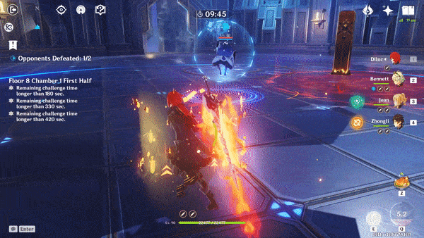
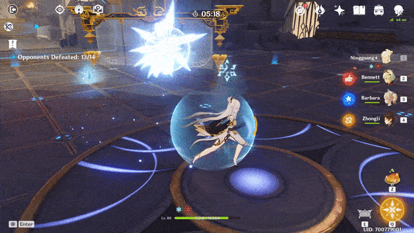

# Information

Debuff auras cover a massive area of the Arena. There are 4 types of Debuff auras you can encounter, and when you are affected by them they give you the same debuffs as the ones from **Ley Line Disorders** in domains and abyss floors, depending on which element it is.

| Aura | Effect |
| :--- | :--- |
|  **Smoldering Flames** | Deals Pyro damage once every second. |
|  **Condensed Ice** | Increases Stamina Consumption by 2x |
|  **Slowing Water** | Increases Skill Cooldowns by 2x |
|  **Engulfing Storm** | Takes away 5 energy every 3 seconds over 18 seconds. |

## Mechanics

|   |   |
| :--- | :--- |
| **Timer** | 15s |
| **Duration** | 20s |

The main differences between enemy auras and Ley Line Disorders are that enemy auras are generally harder to cleanse with specific characters. The duration of enemy auras also cannot be reduced by using elemental resonance.

<table>
  <thead>
    <tr>
      <th style="text-align:left"></th>
      <th style="text-align:left"></th>
    </tr>
  </thead>
  <tbody>
    <tr>
      <td style="text-align:left">
        
      </td>
      <td style="text-align:left">
        
When you get hit by the debuff you will have the element icon above your
          character and also a red crossed out version of the element on top of your
          health bar.

        

        
If you do not have any element applied then it will also apply that element
          depending on what debuff you get.

      </td>
    </tr>
    <tr>
      <td style="text-align:left">
        
      </td>
      <td style="text-align:left">The only way to avoid getting hit by the aura is just being out of it&apos;s
        range. You <b>cannot </b>iframe dash, use geo constructs or use Venti&apos;s
        wind current to dodge it when inside the area.</td>
    </tr>
    <tr>
      <td style="text-align:left">
        
      </td>
      <td style="text-align:left">
        
You can remove the debuff early by using elemental reactions, by getting
          hit by an enemy. Be careful with certain elemental reactions when removing
          elements.

        

        
Some auras cannot be removed with specific elements because of elemental
          priorities or because the reactions cannot remove the element that causes
          the debuff.

      </td>
    </tr>
  </tbody>
</table>

